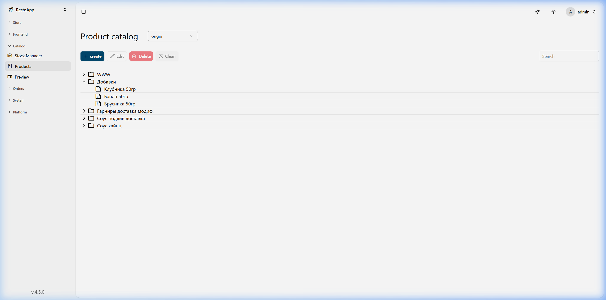
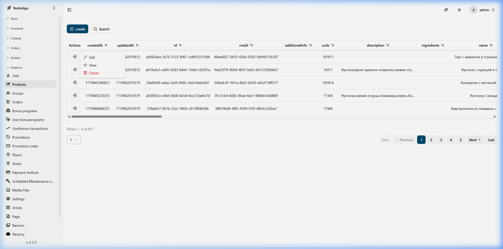

# 🥗 Управление каталогом и блюдами

Этот раздел описывает, как управлять блюдами, категориями и их иерархической структурой.

## 📁 Навигация через дерево категорий
Основной интерфейс для навигации по каталогу продуктов — это **Дерево категорий (Tree View)**. Этот вид позволяет управлять организацией блюд в различных папках/категориях.

*Рисунок 1: Иерархическая структура каталога.*

**Как получить доступ:**
1.  Перейдите в **Каталог (Catalog)** -> **Продукты (Products)** на боковой панели.
2.  Выберите нужный терминал (например, `origin`) из выпадающего списка **Select Ids**.
3.  Появится иерархическое дерево, показывающее корневые папки, такие как `restoapp.org`, `Добавки`, `Гарниры` и т. д.

## 🖱️ Контекстное меню (действия правой кнопкой мыши)
Чтобы управлять конкретной папкой или блюдом непосредственно из дерева, используйте правую кнопку мыши.

1.  **Открыть/Просмотреть**: Нажмите правой кнопкой мыши на папку или блюдо и выберите "Просмотр" (View), чтобы увидеть их содержимое или детали.
2.  **Редактировать**: Выберите "Редактировать" (Edit), чтобы изменить такие параметры, как артикул (SKU), название, цены и описания.

*Рисунок 2: Контекстное меню для действий с продуктом (Редактировать, Просмотреть, Удалить).*

## 📝 Редактирование блюд и каталогов
Подробную информацию о продукте также можно найти в разделе **Платформа (Platform)** -> **Продукты (Products)**.

**Основные атрибуты при редактировании:**
*   **SKU**: Технический уникальный идентификатор (артикул).
*   **SEO-метаданные**: Заголовок (Title), ключевые слова (Keywords) и мета-описание (Meta Descriptions) для веб-сайта.
*   **Пищевая ценность**: Белки, жиры, углеводы и калорийность.
*   **Ценообразование**: Базовые и рекламные цены.

Для структурных изменений (таких как добавление новых папок или перемещение продуктов) предпочтительным инструментом является дерево категорий.
