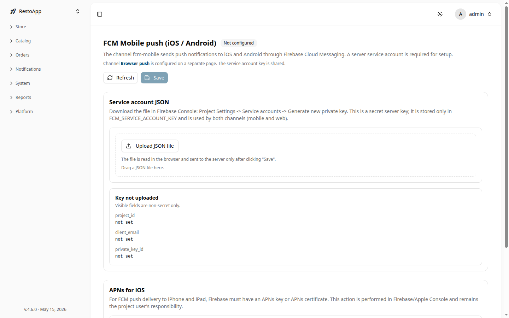

# 🔥 Настройки FCM (Push-уведомления)

Раздел FCM Mobile push отвечает за настройку отправки push-уведомлений на мобильные устройства (iOS и Android) через Firebase Cloud Messaging (FCM).

Раздел доступен по пути: **Sidebar → Platform → FCM Mobile push**.

## 📋 Статус канала

В заголовке страницы отображается текущий статус конфигурации канала:

- **Not configured** — сервисный ключ Firebase не загружен, отправка уведомлений невозможна
- **Configured** — ключ загружен, канал активен

<figure markdown="1">
  

{ loading=lazy }
  

  <figcaption>Рисунок 1: Страница настройки FCM Mobile push с формой загрузки Service account JSON.</figcaption>
</figure>

## 🔑 Service account JSON

Для работы канала необходим файл сервисного аккаунта Firebase:

1. Откройте [Firebase Console](https://console.firebase.google.com) → **Project Settings** → **Service accounts**
2. Нажмите **Generate new private key** — скачается JSON-файл
3. На странице FCM Mobile push нажмите **Upload JSON file** или перетащите файл в обозначенную область
4. Нажмите **Save** для сохранения ключа

> [!WARNING]
> Сервисный ключ — это секретные данные. Он хранится в настройке `FCM_SERVICE_ACCOUNT_KEY` и **не отображается** в интерфейсе после сохранения. Для проверки загрузки используйте блок статуса ключа ниже формы.

### Статус текущего ключа

После загрузки ключа в блоке **Key** отображаются несекретные поля:

- `project_id` — идентификатор Firebase-проекта
- `client_email` — email сервисного аккаунта
- `private_key_id` — идентификатор ключа

Если ключ не загружен, все поля показывают `not set`.

## 🍎 APNs для iOS

Для доставки push-уведомлений на iPhone и iPad через Firebase необходимо настроить APNs (Apple Push Notification service). Это делается в **Apple Developer Console** / **Firebase Console** и не требует действий в данном интерфейсе.

> [!NOTE]
> Канал **Browser push** (web-уведомления) настраивается на отдельной странице, но использует тот же сервисный ключ FCM.
