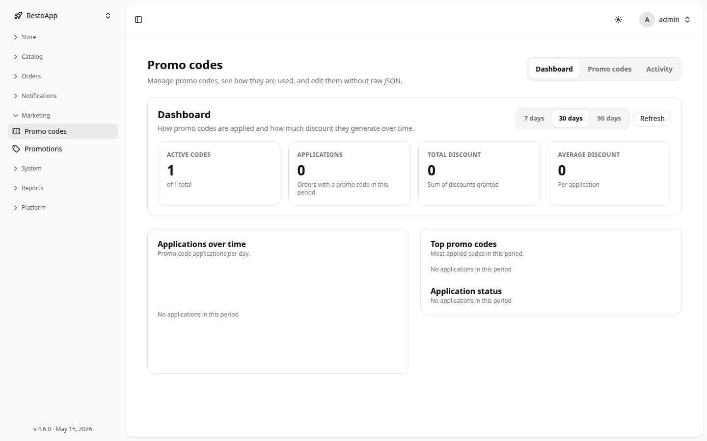
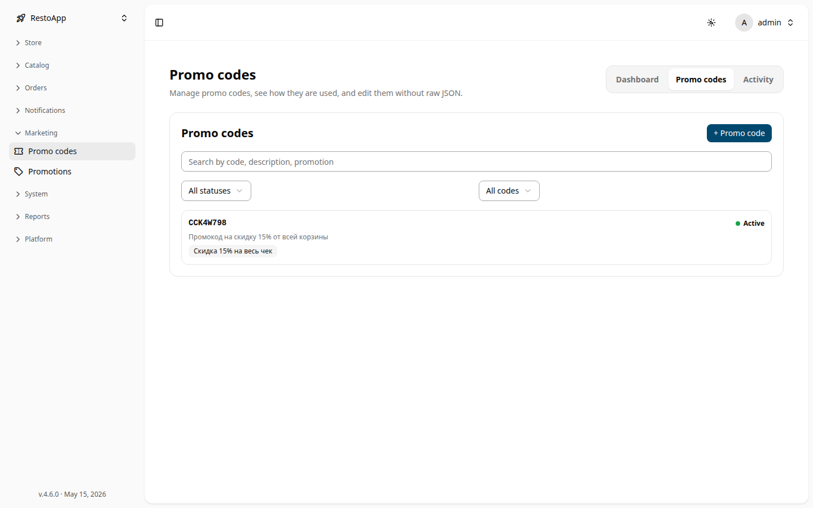
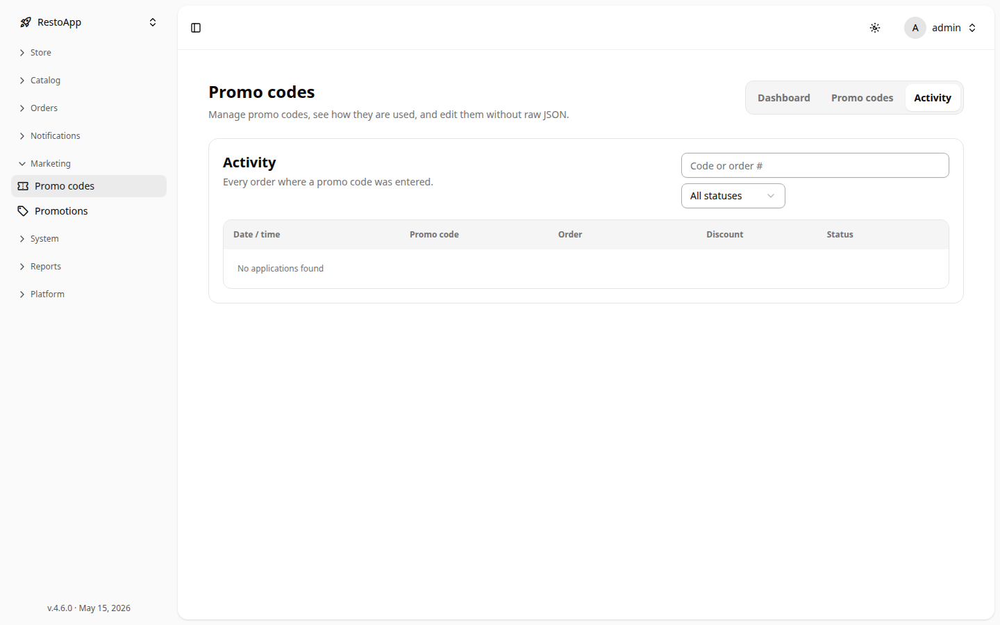
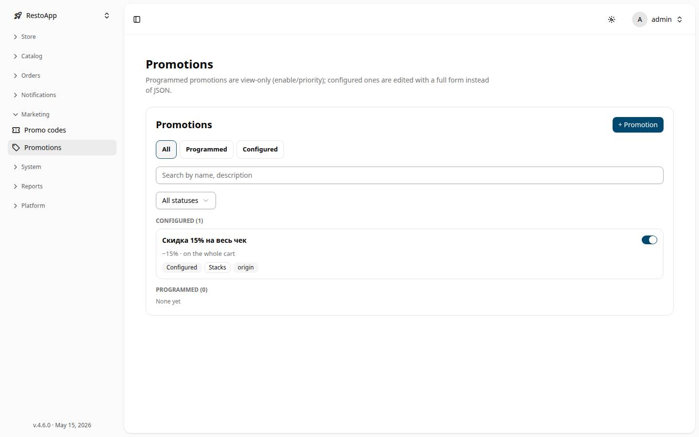
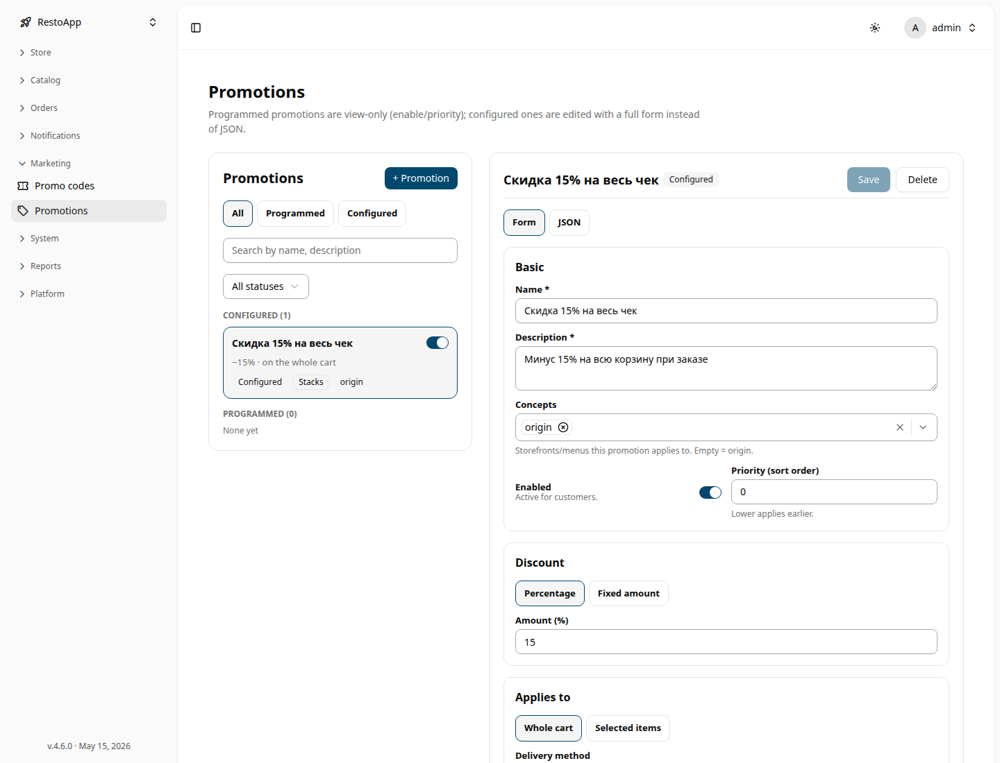

# 🎟️ Marketing

The **Marketing** section replaces the old raw tables for discounts with two guided
managers — **Promo codes** and **Promotions** — so you can configure offers with forms
instead of editing JSON.

Path: **Sidebar → Marketing**

> A **promo code** does nothing on its own. It activates the **promotions** linked to it
> when a customer enters the code at checkout. Create the promotion first, then create a
> code that points to it.

---

## 🏷️ Promo codes

Path: **Sidebar → Marketing → Promo codes**

The page has three tabs: **Dashboard**, **Promo codes**, and **Activity**.

### Dashboard

<figure>
  

    
  

  <figcaption>The Promo codes Dashboard — KPI cards, charts, and the date-range selector.</figcaption>
</figure>

Pick a range (**7 / 30 / 90 days**) and **Refresh** to reload. The cards summarise the period:

| Card | Meaning |
|------|---------|
| **Active codes** | Codes currently usable, out of the total |
| **Applications** | Orders that used a promo code in the period |
| **Total discount** | Sum of discounts granted |
| **Average discount** | Discount per application |

Below the cards: an **Applications over time** bar chart (hover a day for exact figures), a
**Top promo codes** ranking, and an **Application status** breakdown (applied vs invalid).

### Promo codes list

*The promo codes list with search, status and binding filters.*

- **Search** by code, description, or linked promotion.
- **Status** filter: *All / Active / Scheduled / Expired*.
- **Binding** filter: *All / With promotions / Without promotions*.
- **+ Promo code** creates a new code.

### Creating / editing a code

| Field | Description |
|-------|-------------|
| **Code** | What the customer types at checkout (letters and digits). Press **Generate** for a random code; availability is checked as you type — a code already in use is rejected. |
| **Description** *(required)* | Shown to the operator and stored on the order. |
| **Type** | *Static* (one fixed code). *Generated / Serial / External* are coming soon. |
| **Linked promotions** | The promotions this code activates. A summary of what each grants is shown below the picker. |
| **Validity period** | **Start / End date** — leave empty for no limit. |
| **Advanced** | **External ID**, **Prefix**, a fine-grained **Schedule** (work-time), and a **Custom data (JSON)** field. |

Use **Save** to store, **Duplicate** to clone an existing code into a new draft, and
**Delete** to remove it (already-issued codes stop working).

### Activity

*The Activity log of orders where a promo code was entered.*

Every order where a promo code was entered, with **date/time, code, order, discount,** and
**status** (*Applied* / *Invalid*). Click a row to expand the promotion state and open the
order. Search by code or order number and filter by status.

---

## 🔖 Promotions

Path: **Sidebar → Marketing → Promotions**

There are two kinds of promotion:

- **Programmed** — defined in code/a module. **View-only**: you can change only **Enable**
  and **Priority**, not the discount itself.
- **Configured** — created here and edited with a full form.

*Promotions grouped into Configured and Programmed, with kind and status filters.*

Filter by kind (**All / Programmed / Configured**), search by name or description, and
filter by status (**Enabled / Disabled**). Each card shows the discount summary and badges
(Configured/Programmed, Stacks/Exclusive, Storefront, 🎁 Gift).

### Configured promotion form

<figure>
  

    
  

  <figcaption>The configured promotion editor — Form / JSON toggle, discount type, Save / Delete.</figcaption>
</figure>

| Block | Fields |
|-------|--------|
| **Basic** | **Name** *(required)*, **Description** *(required)*, **Concepts** (storefronts/menus; empty = origin), **Enabled** toggle, **Priority (sort order)** — lower applies earlier. |
| **Discount** | **Percentage** or **Fixed amount**, plus the **Amount**. |
| **Applies to** | **Whole cart** or **Selected items** (pick **Groups** and **Dishes**). **Delivery method** (Delivery / Self-service; leave both off for any). **Do not apply to modifiers**. **Exclusions** — excluded groups and dishes. |
| **Behaviour** | **Compatibility** — *Stacks with others* or *Exclusive* (exclusive applies alone, first). **Show in storefront / API** — lets the client display the discount. |
| **Gift & conditions** | **Minimum basket for promo code** (₽, only checked when applied via a code). **Add gift items** toggle → **Gift threshold** and **Gift items** with a quantity each. Gifts are auto-added once the basket reaches the threshold and removed if it drops below. |
| **Schedule** | Work-time editor; leave empty for always-on. |
| **Summary** | A plain-language preview of the configured offer. |
| **Advanced** | **External ID** and **Badge** (read-only). |

A **Form / JSON** toggle (for existing records) shows the raw stored object for reference.
**Save** stores changes; **Delete** soft-deletes the promotion and turns it off.

### Programmed promotion detail

<!-- screenshot pending: no Programmed promotions exist in this instance to capture -->

A read-only overview (description, discount, concepts, compatibility, storefront, external
ID). You may toggle **Enable** and adjust **Priority** only.

---

## 📱 Mobile

Both managers are responsive. On a phone the list and the editor are shown one at a time:
open an item to edit it, then use **← Back** to return to the list. Tables (the Activity
log) become stacked cards.
