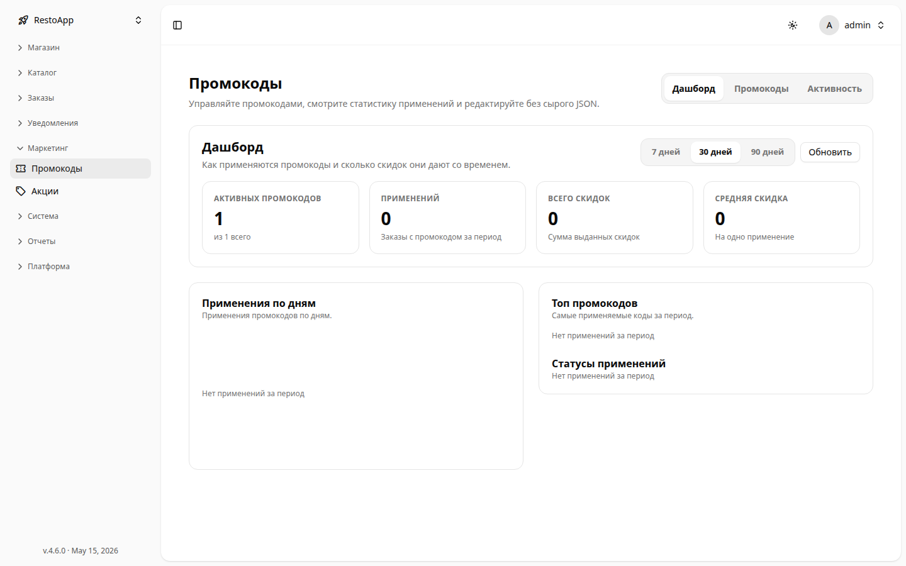
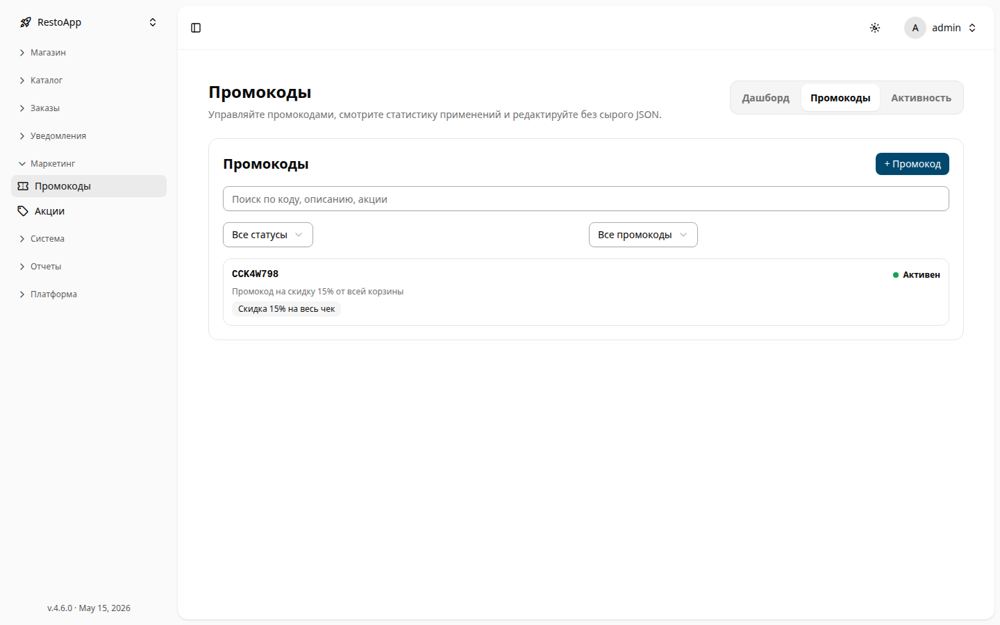
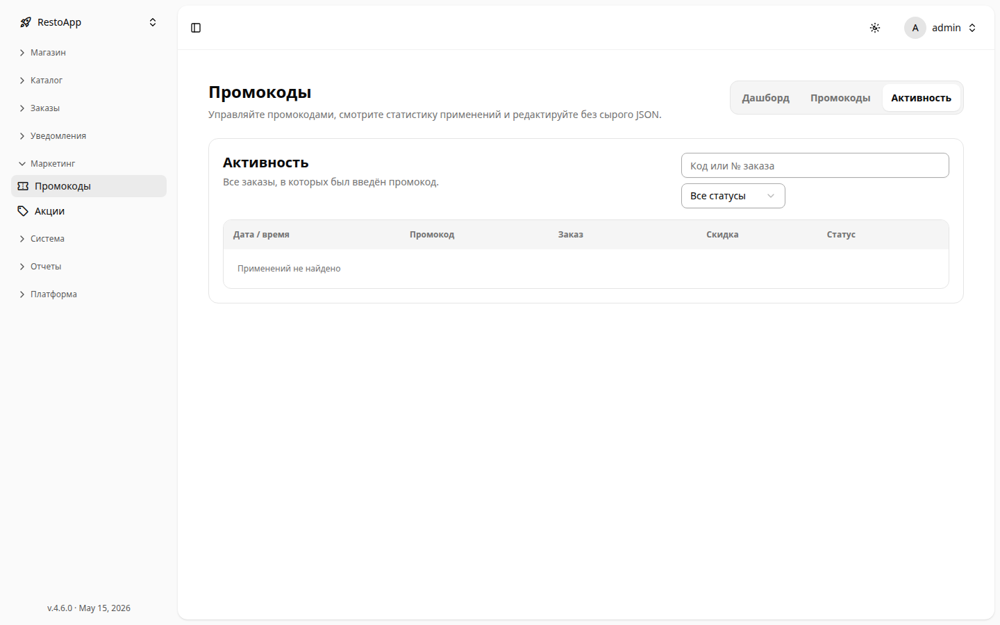
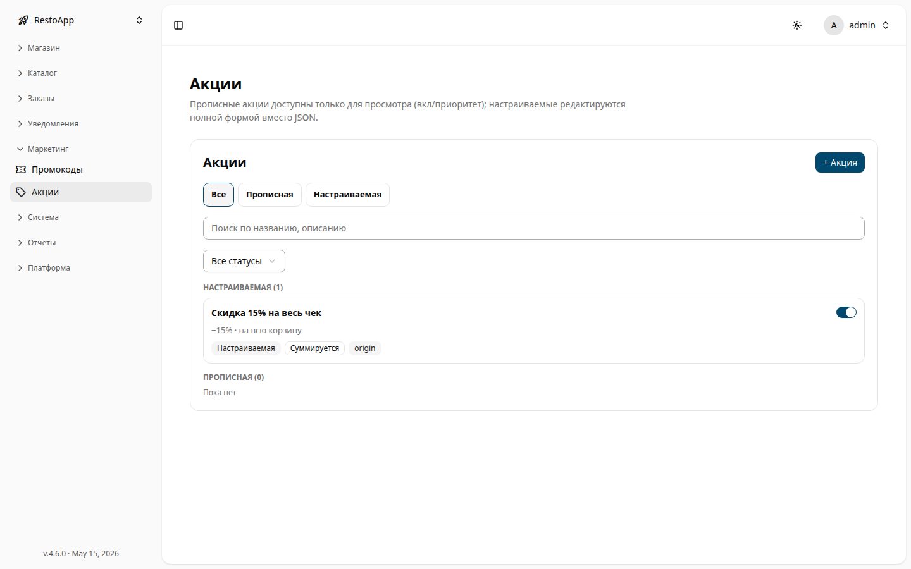
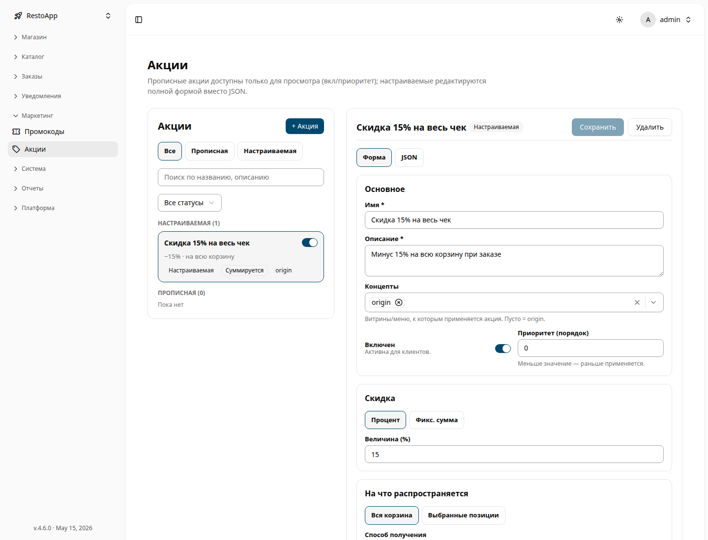

# 🎟️ Маркетинг

Раздел **Маркетинг** заменяет старые «сырые» таблицы скидок двумя удобными менеджерами —
**Промокоды** и **Акции**, — чтобы настраивать предложения через формы, а не редактируя JSON.

Раздел доступен по пути: **Sidebar → Marketing**.

> **Промокод** сам по себе ничего не делает. Он активирует привязанные к нему **акции**,
> когда клиент вводит код при оформлении заказа. Сначала создайте акцию, затем — код,
> который на неё ссылается.

---

## 🏷️ Промокоды

Раздел доступен по пути: **Sidebar → Marketing → Promo codes**.

Страница состоит из трёх вкладок: **Dashboard** (Панель), **Promo codes** (Промокоды) и
**Activity** (Активность).

### Панель (Dashboard)

<figure>
  

    
  

  <figcaption>Дашборд промокодов — карточки KPI, графики и выбор периода.</figcaption>
</figure>

Выберите период (**7 / 30 / 90 дней**) и нажмите **Refresh** для обновления. Карточки
показывают сводку за период:

| Карточка | Значение |
|----------|----------|
| **Active codes** | Сейчас активных кодов из общего числа |
| **Applications** | Заказы, в которых применён промокод за период |
| **Total discount** | Сумма предоставленных скидок |
| **Average discount** | Скидка на одно применение |

Ниже: график **Applications over time** (наведите на день для точных цифр), рейтинг
**Top promo codes** и разбивка **Application status** (применён / недействителен).

### Список промокодов

*Список промокодов с поиском и фильтрами по статусу и привязке.*

- **Поиск** по коду, описанию или привязанной акции.
- Фильтр **Status**: *All / Active / Scheduled / Expired*.
- Фильтр **Binding**: *All / With promotions / Without promotions*.
- **+ Promo code** — создать новый код.

### Создание / редактирование кода

| Поле | Описание |
|------|----------|
| **Code** | То, что клиент вводит при оформлении (буквы и цифры). Кнопка **Generate** создаёт случайный код; доступность проверяется при вводе — уже занятый код отклоняется. |
| **Description** *(обязательно)* | Видно оператору и сохраняется в заказе. |
| **Type** | *Static* (один фиксированный код). *Generated / Serial / External* — скоро. |
| **Linked promotions** | Акции, которые активирует код. Под списком показано, что даёт каждая. |
| **Validity period** | **Start / End date** — оставьте пустым для без ограничения. |
| **Advanced** | **External ID**, **Prefix**, точное расписание (**Schedule**, work-time) и поле **Custom data (JSON)**. |

**Save** — сохранить, **Duplicate** — скопировать код в новый черновик, **Delete** —
удалить (уже выданные коды перестанут работать).

### Активность (Activity)

*Журнал активности: заказы, в которых был введён промокод.*

Каждый заказ, где был введён промокод: **дата/время, код, заказ, скидка** и **статус**
(*Applied* / *Invalid*). Нажмите строку, чтобы раскрыть состояние акции и открыть заказ.
Поиск по коду или номеру заказа, фильтр по статусу.

---

## 🔖 Акции

Раздел доступен по пути: **Sidebar → Marketing → Promotions**.

Существует два вида акций:

- **Programmed** (Запрограммированные) — заданы в коде/модуле. **Только просмотр**: можно
  менять лишь **Enable** и **Priority**, но не саму скидку.
- **Configured** (Настраиваемые) — создаются здесь и редактируются полной формой.

*Акции с разделением на Настраиваемые и Прописные, с фильтрами по виду и статусу.*

Фильтр по виду (**All / Programmed / Configured**), поиск по названию или описанию и фильтр
по статусу (**Enabled / Disabled**). На карточке — сводка скидки и метки (Configured/Programmed,
Stacks/Exclusive, Storefront, 🎁 Gift).

### Форма настраиваемой акции

<figure>
  

    
  

  <figcaption>Редактор настраиваемой акции — переключатель Форма / JSON, тип скидки, Сохранить / Удалить.</figcaption>
</figure>

| Блок | Поля |
|------|------|
| **Basic** | **Name** *(обязательно)*, **Description** *(обязательно)*, **Concepts** (витрины/меню; пусто = origin), переключатель **Enabled**, **Priority (sort order)** — меньше = применяется раньше. |
| **Discount** | **Percentage** или **Fixed amount** и **Amount** (величина). |
| **Applies to** | **Whole cart** или **Selected items** (выбор **Groups** и **Dishes**). **Delivery method** (Delivery / Self-service; оба выключены = любой способ). **Do not apply to modifiers**. **Exclusions** — исключённые группы и блюда. |
| **Behaviour** | **Compatibility** — *Stacks with others* или *Exclusive* (эксклюзивная применяется одна, первой). **Show in storefront / API** — отображать скидку в клиенте. |
| **Gift & conditions** | **Minimum basket for promo code** (₽, проверяется только при применении через код). Переключатель **Add gift items** → **Gift threshold** и **Gift items** с количеством. Подарки добавляются автоматически при достижении порога и удаляются, если корзина опускается ниже. |
| **Schedule** | Редактор work-time; пусто = всегда активна. |
| **Summary** | Понятный текстовый предпросмотр настроенного предложения. |
| **Advanced** | **External ID** и **Badge** (только чтение). |

Переключатель **Form / JSON** (для существующих записей) показывает исходный объект.
**Save** сохраняет изменения; **Delete** мягко удаляет акцию и выключает её.

### Карточка запрограммированной акции

<!-- скриншот ожидается: в этом экземпляре нет прописных (Programmed) акций для съёмки -->

Обзор только для чтения (описание, скидка, концепции, совместимость, витрина, External ID).
Менять можно лишь **Enable** и **Priority**.

---

## 📱 Мобильная версия

Оба менеджера адаптивны. На телефоне список и редактор показываются по очереди: откройте
элемент для редактирования, затем вернитесь к списку кнопкой **← Back**. Таблицы (журнал
Activity) превращаются в карточки.
