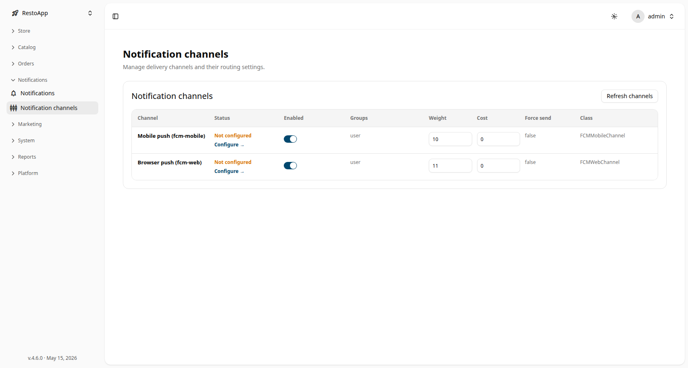

# 📡 Notification Channels

The **Notification Channels** page configures *how* notifications are delivered — push, SMS,
email, messengers and other adapters — and the order in which they are tried.

Path: **Sidebar → Notifications → Notification channels**

> This page controls the delivery **transports**. *What* gets sent and *to whom* is managed
> in the [Notifications Manager](notifications-manager.md).

## Channel list

<figure>
  

    
  

  <figcaption>The notification channels list with status, enabled toggle and weight per channel.</figcaption>
</figure>

Each registered channel is shown with:

| Column | Description |
|--------|-------------|
| **Channel** | The channel adapter and key (e.g. `Mobile push (fcm-mobile)`, `Browser push (fcm-web)`). |
| **Status** | `Not configured` or ready, with a **Configure →** link to finish setup. |
| **Enabled** | Toggle — whether the channel is active and may be used for delivery. |
| **Groups** | The recipient groups this channel serves (e.g. `user`). |
| **Weight** | Priority used when several channels can deliver the same message. |
| **Cost** | The cost charged per message sent through this channel. |
| **Force send** | Whether delivery is forced even if another channel already succeeded. |
| **Class** | The implementing adapter class (e.g. `FCMMobileChannel`). |

Use **Refresh channels** (top right) to re-read the registered channels.

## Editing a channel

Open a channel to edit its settings:

- Toggle **Enabled** to turn the transport on or off.
- Set the **Weight** to control its priority when several channels can deliver the same
  message.
- Set the per-message **Cost** used for budgeting and reporting.
- Fill the channel-specific **settings** (API keys, sender IDs, endpoints, etc.).

Click the **Configure →** link or **Save** to apply. If credentials are wrong the channel
**Status** stays `Not configured` — fix the settings and save again.

> [!WARNING]
> Disabling or misconfiguring a channel stops every notification type that relies on it.
> Check the [Notifications Manager](notifications-manager.md) **Activity** tab after changes
> to confirm deliveries still succeed.
