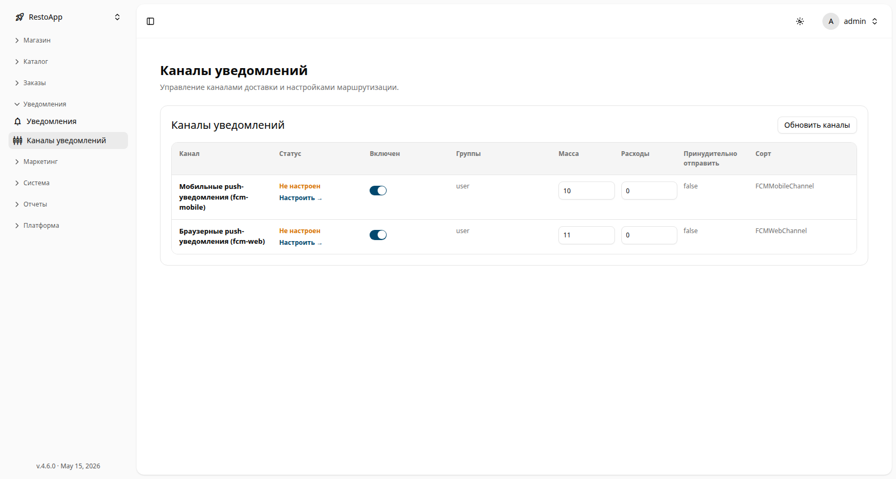

# 📡 Каналы уведомлений

Страница **Notification Channels** (каналы уведомлений) настраивает, *как* доставляются
уведомления — push, SMS, email, мессенджеры и другие адаптеры — и в каком порядке они
используются.

Раздел доступен по пути: **Sidebar → Notifications → Notification channels**.

> Эта страница управляет **транспортами** доставки. *Что* отправляется и *кому* —
> настраивается в [Менеджере уведомлений](notifications-manager.md).

## Список каналов

<figure>
  

    
  

  <figcaption>Список каналов уведомлений со статусом, переключателем включения и весом по каждому каналу.</figcaption>
</figure>

Для каждого зарегистрированного канала отображается:

| Колонка | Описание |
|---------|----------|
| **Канал** | Адаптер канала и его ключ (например, `Mobile push (fcm-mobile)`, `Browser push (fcm-web)`). |
| **Статус** | `Не настроен` или готов, со ссылкой **Настроить →** для завершения настройки. |
| **Включён** | Переключатель — активен ли канал и может ли использоваться для доставки. |
| **Группы** | Группы получателей, которые обслуживает канал (например, `user`). |
| **Вес** | Приоритет, когда сообщение могут доставить несколько каналов. |
| **Стоимость** | Стоимость одного сообщения через этот канал. |
| **Принудительно отправить** | Доставлять ли принудительно, даже если другой канал уже успешно доставил. |
| **Сорт (Class)** | Класс-адаптер, реализующий канал (например, `FCMMobileChannel`). |

Кнопка **Обновить каналы** (справа вверху) перечитывает зарегистрированные каналы.

## Редактирование канала

Откройте канал, чтобы изменить настройки:

- Переключатель **Включён** включает или выключает транспорт.
- **Вес** задаёт приоритет канала, когда сообщение могут доставить несколько каналов.
- **Стоимость** — цена одного сообщения для бюджета и отчётности.
- Заполните **настройки** канала (API-ключи, идентификаторы отправителя, endpoint и т. д.).

Нажмите ссылку **Настроить →** или **Save** для применения. При неверных учётных данных
**Статус** останется `Не настроен` — исправьте настройки и сохраните снова.

> [!WARNING]
> Отключение или неправильная настройка канала останавливает все типы уведомлений, которые
> на него опираются. После изменений проверьте вкладку **Activity** в
> [Менеджере уведомлений](notifications-manager.md), чтобы убедиться, что доставка работает.
