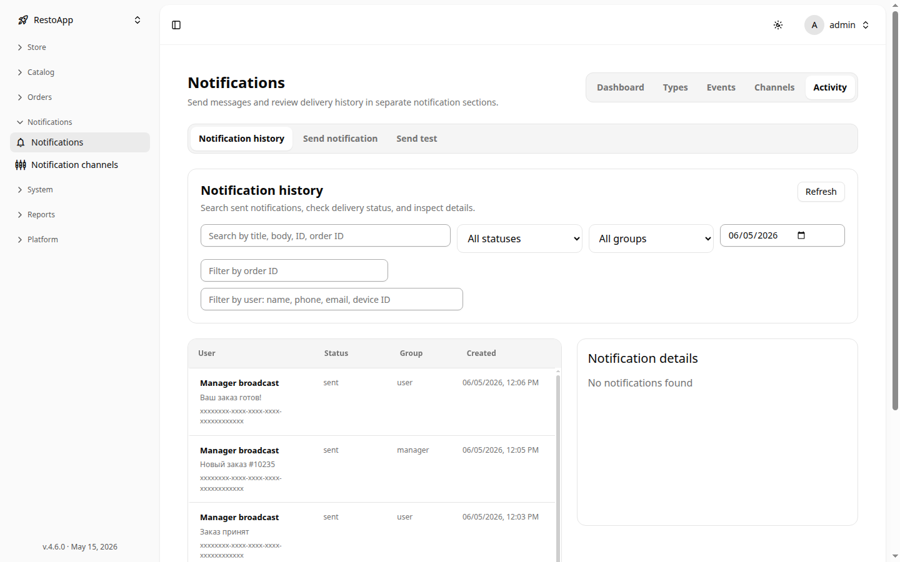
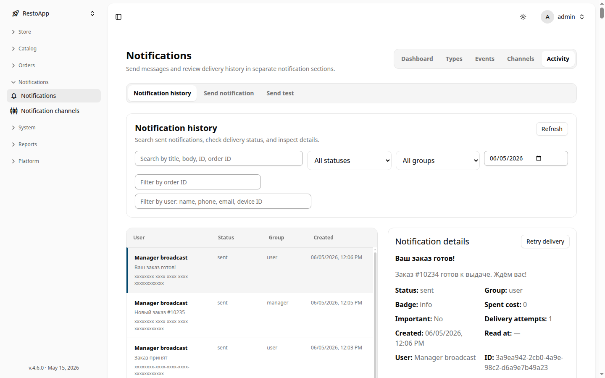

# 🔔 Менеджер уведомлений

Менеджер уведомлений — это раздел для мониторинга и управления всеми уведомлениями, отправляемыми пользователям. Здесь можно просматривать историю отправок, фильтровать их по статусу и группе, а также повторять доставку при необходимости.

Раздел доступен по пути: **Sidebar → Notifications → Notifications**.

## 📋 История уведомлений (Activity)

На вкладке **Activity** отображается список всех уведомлений, отправленных через систему. Каждая строка содержит:

- **Пользователь** — кому адресовано уведомление
- **Статус** — `sent` (доставлено) или `failed` (ошибка доставки)
- **Группа** — тип получателей (`user`, `manager` и т.д.)
- **Время создания**

<figure markdown="1">
  

{ loading=lazy }
  

  <figcaption>Рисунок 1: Список истории уведомлений с фильтрами.</figcaption>
</figure>

### Фильтры

В верхней части списка доступны фильтры:

| Фильтр | Описание |
|--------|----------|
| Поиск по тексту | Поиск по заголовку или телу уведомления |
| Статус | `sent`, `failed`, все |
| Группа | Фильтр по группе получателей |
| Диапазон дат | Выбор периода для фильтрации |

Кнопка **Refresh** в правом верхнем углу обновляет список.

## 🔍 Детали уведомления

При нажатии на строку списка справа открывается панель **Notification details** с подробной информацией об уведомлении:

- **Title / Body** — заголовок и текст уведомления
- **Status** — текущий статус доставки
- **Group** — группа получателей
- **Spent cost** — стоимость доставки
- **Delivery attempts** — количество попыток доставки
- **ID** — уникальный идентификатор

<figure markdown="1">
  

{ loading=lazy }
  

  <figcaption>Рисунок 2: Панель деталей уведомления с кнопкой повторной отправки.</figcaption>
</figure>

### Повторная отправка

Если уведомление не было доставлено (`failed`), в панели деталей доступна кнопка **Retry delivery**. Нажатие на неё инициирует повторную попытку отправки через все настроенные каналы.

> [!TIP]
> Используйте фильтр по статусу `failed` для быстрого поиска уведомлений, требующих повторной отправки.
