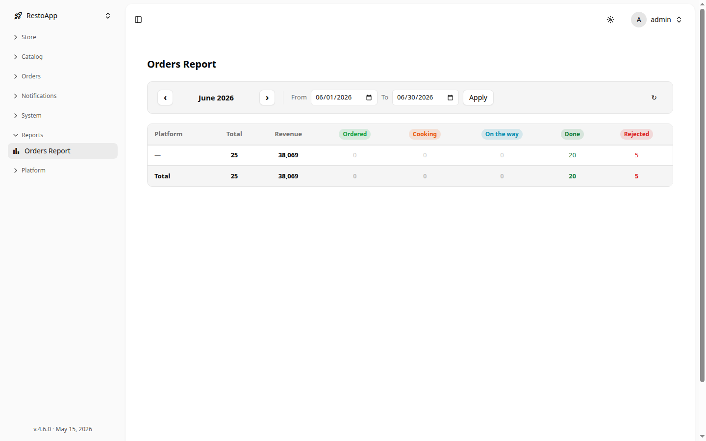

# 📊 Отчёт по заказам

Раздел Orders Report предоставляет сводную аналитику по заказам за выбранный период. Данные разбиты по платформам и статусам, что позволяет быстро оценить объём заказов и выручку.

Раздел доступен по пути: **Sidebar → Reports → Orders Report**.

## 📅 Выбор периода

В верхней части страницы находится панель навигации по периоду:

- **Стрелки ‹ ›** — переключение на предыдущий/следующий месяц
- **From / To** — поля ввода начальной и конечной дат
- **Apply** — кнопка применения выбранного диапазона
- **Кнопка обновления** (↺) — перезагрузить данные

<figure>
  

    
  

  <figcaption>Рисунок 1: Сводный отчёт по заказам за июнь с разбивкой по статусам.</figcaption>
</figure>

## 📈 Сводная таблица

Таблица содержит строки по каждой платформе (источнику заказов) и итоговую строку **Total**:

| Колонка | Описание |
|---------|----------|
| **Platform** | Источник заказа (название платформы или `—` если не указан) |
| **Total** | Общее количество заказов |
| **Revenue** | Суммарная выручка |
| **Ordered** | Заказы в статусе «Принят» |
| **Cooking** | Заказы в процессе приготовления |
| **On the way** | Заказы на доставке |
| **Done** | Выполненные заказы |
| **Rejected** | Отменённые заказы |

> [!TIP]
> Строка **Total** в нижней части таблицы суммирует показатели по всем платформам. Используйте её для быстрой оценки общей картины за период.
