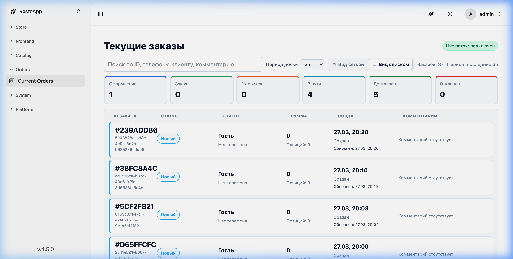
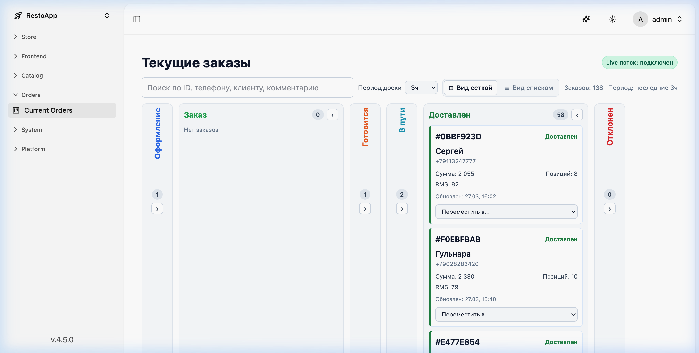

# 📋 Управление заказами

Административная панель предлагает два режима управления текущими заказами: Канбан (Kanban) и Стопка (Stack). 

> [!IMPORTANT]
> Режим **Канбан** планируется к удалению в будущих обновлениях. Документация сосредоточена на режиме **Стопка**, который останется основным видом.

## 📚 Режим "Стопка"
Режим "Стопка" обеспечивает компактный табличный вид всех текущих заказов, оптимизированный для работы с большими объемами.

*Рисунок 1: Заказы в режиме "Стопка" (список).*

**Ключевые информационные столбцы:**
*   **ID ЗАКАЗА**: Уникальный ID заказа и короткий хеш.
*   **СТАТУС**: Текущий статус (например, "Новый").
*   **КЛИЕНТ**: Имя и номер телефона.
*   **СУММА**: Общая сумма заказа и количество позиций.
*   **СОЗДАН**: Дата и время создания.
*   **КОММЕНТАРИЙ**: Дополнительные примечания от клиента.

## 🚀 Поток заказов
Хотя вид Канбан (показан ниже для контекста) визуализирует стандартный поток, логика на сервере остается одинаковой для обоих видов:

*Рисунок 2: Поток заказов, визуализированный в режиме Канбан.*

**Стандартный поток:**
1.  **Новый**: Заказ создан, но еще не подтвержден.
2.  **Заказ**: Заказ подтвержден, ожидает подготовки.
3.  **Готовится**: Кухня готовит еду.
4.  **В пути**: Курьер забрал заказ.
5.  **Доставлен**: Клиент получил заказ.
6.  **Отклонен**: Отмененные заказы.

В режиме "Стопка" эти статусы отражены в колонке **STATUS** и могут быть отфильтрованы с помощью карточек статусов в верхней части интерфейса.
