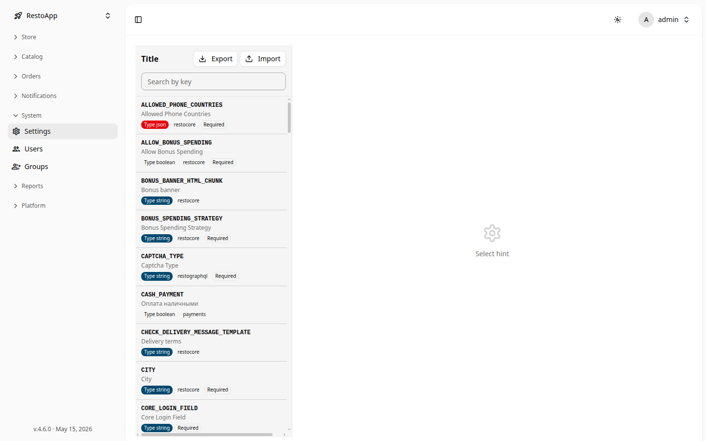
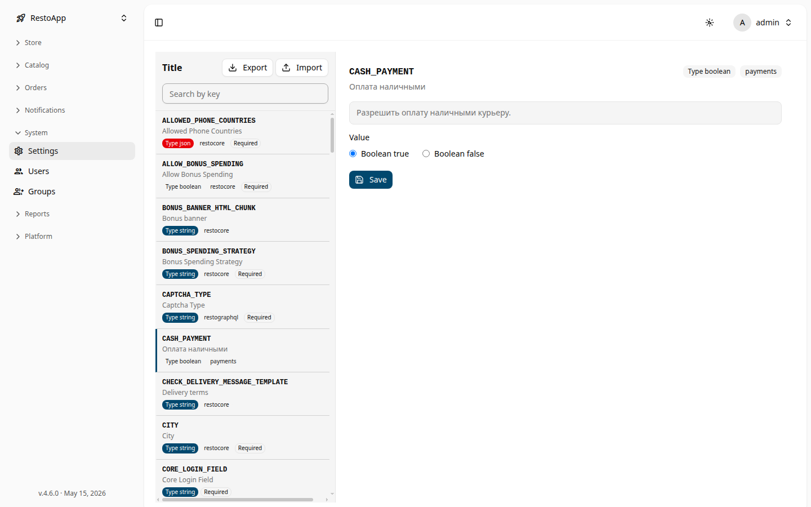

# ⚙️ Менеджер настроек

Менеджер настроек позволяет управлять системными параметрами приложения: настройками сайта, условиями оплаты, ограничениями корзины и другими конфигурационными значениями.

Раздел доступен по пути: **Sidebar → System → Settings Manager**.

## 📋 Список настроек

При входе в раздел отображается таблица всех системных настроек с колонками:

- **Key** — ключ настройки (например, `SITE_NAME`, `CURRENCY`)
- **Value** — текущее значение
- **Type** — тип значения: `string`, `boolean`, `json`

<figure>
  

    
  

  <figcaption>Рисунок 1: Список системных настроек с типами значений.</figcaption>
</figure>

### Экспорт и импорт

В правом верхнем углу доступны кнопки:

- **Export** — выгрузить все настройки в JSON-файл. Удобно для резервного копирования конфигурации.
- **Import** — загрузить настройки из JSON-файла. Позволяет быстро восстановить или перенести конфигурацию на другой сервер.

> [!WARNING]
> Импорт перезаписывает существующие значения. Убедитесь, что импортируемый файл соответствует текущей версии приложения.

## ✏️ Редактирование настройки

Нажатие на строку в таблице открывает правую панель редактирования:

<figure>
  

    
  

  <figcaption>Рисунок 2: Панель редактирования настройки с переключателем boolean-значения.</figcaption>
</figure>

В панели отображаются:

- **Ключ** настройки (только для чтения)
- **Описание** — пояснение к параметру
- **Тип** — `string`, `boolean` или `json`
- **Значение** — поле для редактирования. Для `boolean` — переключатель `true/false`, для `json` — текстовое поле с валидацией

После изменения нажмите **Save** для сохранения.

### Типы настроек

| Тип | Описание | Пример |
|-----|----------|--------|
| `string` | Текстовое значение | `SITE_NAME = "Мой ресторан"` |
| `boolean` | Включено / выключено | `ONLINE_PAYMENT = true` |
| `json` | Произвольная структура | `{"key": "value"}` |
