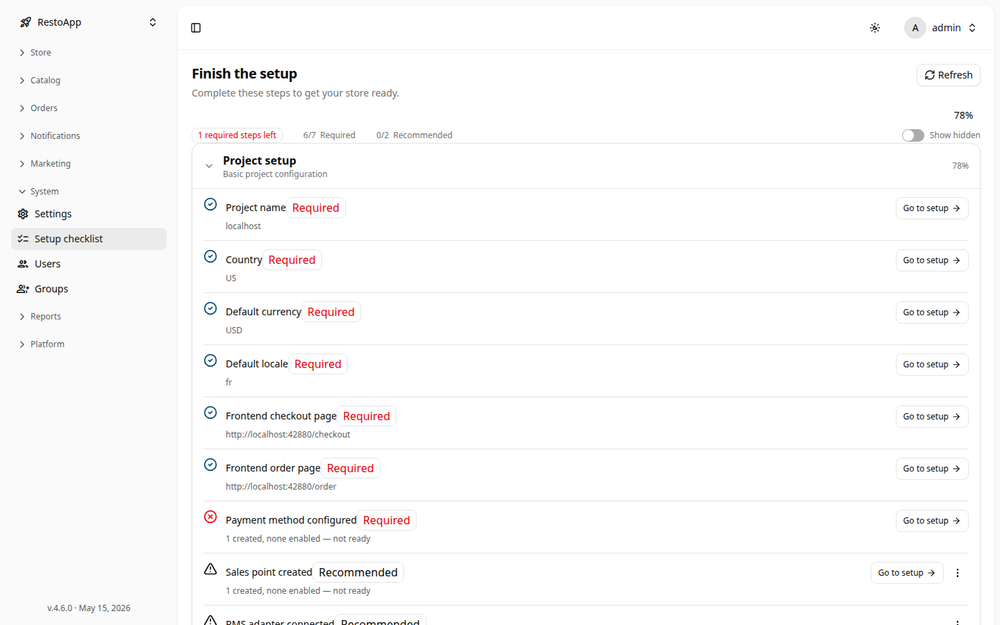

# ✅ Чек-лист настройки

**Setup Checklist** (чек-лист настройки) проводит вас по шагам, необходимым для запуска
нового магазина. Он автоматически проверяет конфигурацию и показывает, что ещё не сделано.

Раздел доступен по пути: **Sidebar → System → Setup checklist**.

## Обзор

<figure markdown="1">
  

{ loading=lazy }
  

  <figcaption>Чек-лист настройки — сводка прогресса, статус по пунктам и ссылки Перейти к настройке.</figcaption>
</figure>

В заголовке отображается общий прогресс. Когда всё обязательное выполнено, появляется метка
**Ready to go**; иначе показывается, сколько **обязательных шагов** осталось. Три чипа
показывают прогресс по важности:

| Чип | Значение |
|-----|----------|
| **Required** | Шаги, без которых магазин не работает |
| **Recommended** | Настоятельно рекомендуется для хорошей настройки |
| **Optional** | Полезные, но необязательные улучшения |

Кнопка **Refresh** перезапускает проверки, **Show hidden** показывает скрытые пункты.

## Пункты чек-листа

Пункты сгруппированы по областям. Каждый пункт показывает:

- **Заголовок** и краткое **описание**.
- Индикатор **прогресса** (например, *3 of 5*) для составных шагов.
- Ссылку **Go to setup**, которая ведёт прямо на экран выполнения шага.

Если проверку выполнить не удалось, отображается **Could not check** — попробуйте **Refresh**.

## Скрытие и откладывание

Для ненужных сейчас пунктов:

- **Hide** убирает пункт из списка (вернуть через **Show hidden** → **Restore**).
- **Snooze for 7 days** временно скрывает пункт; он снова появится через неделю.

> [!TIP]
> Сначала пройдите сверху вниз группу **Required** — эти шаги разблокируют работу магазина.
> **Recommended** и **Optional** можно доработать позже.
