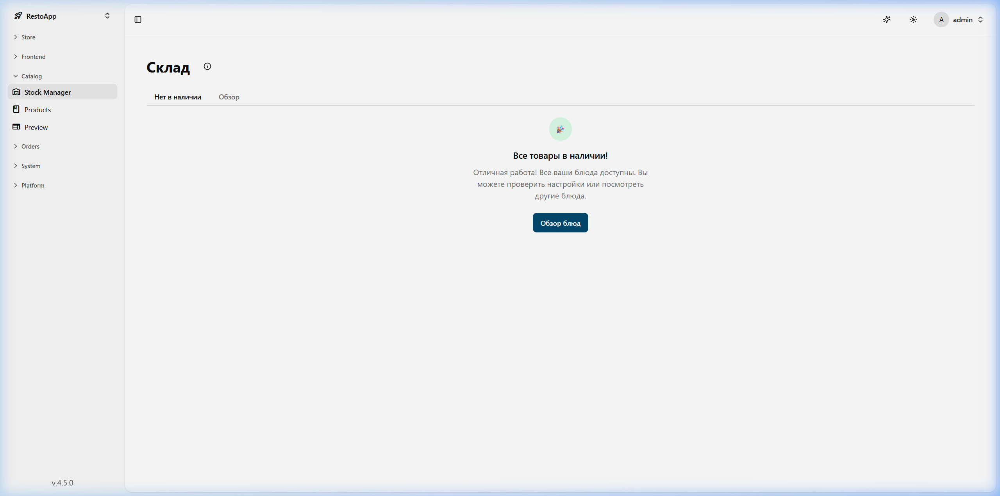
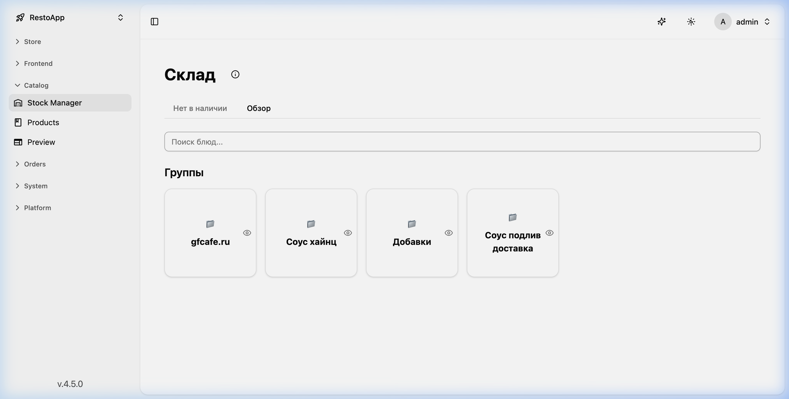
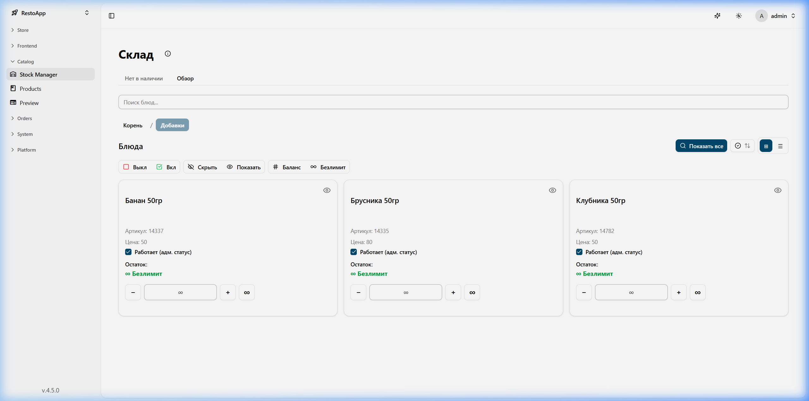
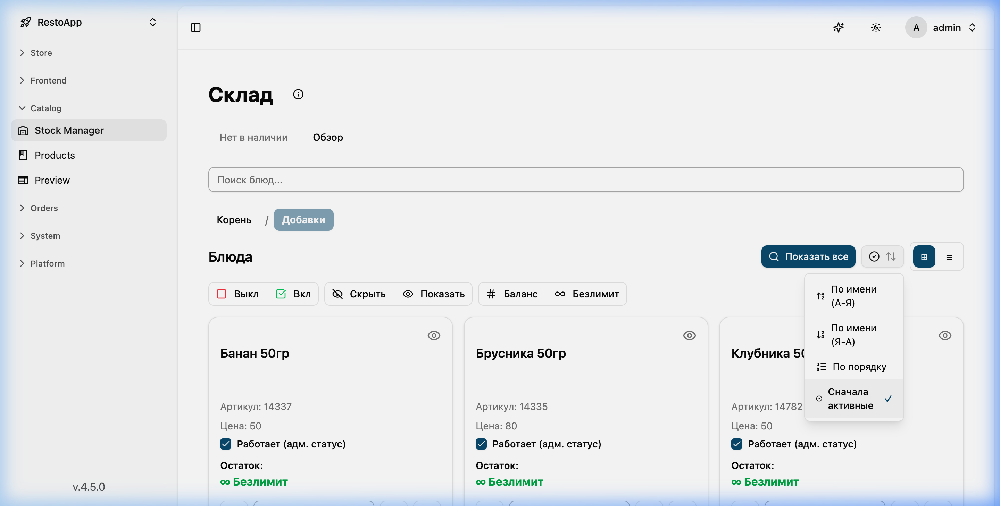
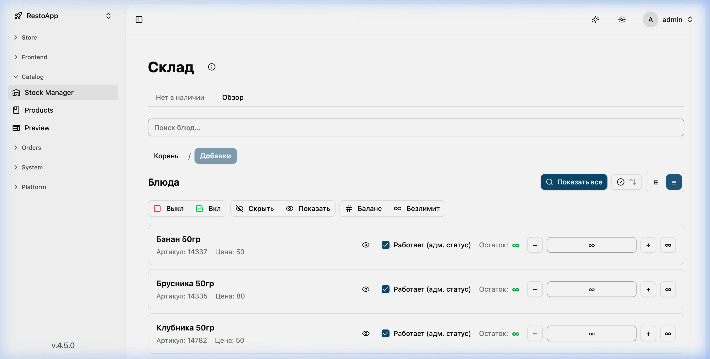

# 📦 Менеджер склада (Стоп-листы)

Менеджер склада используется для контроля доступности блюд в режиме реального времени. Здесь сделан упор на то, что мы можем удобно перемещаться по папкам и управлять отображением позиций, которые пришли из нашей RMS (iiko).

В начале работы при входе в раздел мы видим **Стоп-лист** (список «Нет в наличии»). Это то, что действительно пришло из нашей системы iiko как недоступное.

## 🚫 Стоп-лист (Нет в наличии)
Здесь отображаются все позиции, которые в данный момент находятся в стопе. Это первоначальный список, который актуализируется напрямую из RMS (iiko).

<figure markdown="1">
  

{ loading=lazy }
  

  <figcaption>Рисунок 1: Список позиций в Стоп-листе.</figcaption>
</figure>

## 🔍 Обзор склада
Далее мы можем перейти во вкладку **Обзор**, где есть возможность перемещаться по папкам и категориям меню.

<figure markdown="1">
  

{ loading=lazy }
  

  <figcaption>Рисунок 2: Вкладка Обзора и навигации по папкам Менеджера склада.</figcaption>
</figure>

### Управление группой (Глазик - Hide/Show)
У каждой группы есть значок **Глазика** (Hide/Show), который мы можем включить или выключить. Это быстрое изменение его отображения на сайте (маркетинговое сокрытие). 

**Важный момент:** Если блюдо является **промо**, то даже при выключенном глазике оно будет и дальше работать. Этот способ с глазиком нужен как раз для того, чтобы промо-блюдо можно было скрыть из каталога, но оно продолжало быть доступным.

### Управление внутри группы (Действия с блюдом)
Зайдя внутрь группы, мы управляем карточками конкретных блюд. Здесь доступны рычаги управления состоянием позиции.

<figure markdown="1">
  

{ loading=lazy }
  

  <figcaption>Рисунок 3: Управление состоянием блюда внутри группы.</figcaption>
</figure>

Мы можем управлять 3 параметрами видимости блюда:
1. **Disable / Enable (Выключить/Включить):** 
   Это жесткое выключение блюда. Если блюдо выключено, оно просто исчезает из доступа корзины и каталога.
2. **Hide / Show (Скрыть/Показать глазиком):**
   Это маркетинговое отображение — скрытие видимости, оставляющее функциональность (полезно для промо).
3. **Set Balance (Установить баланс):**
   Сколько порций осталось. Мы сами можем его установить, но он также будет обновлен (перезаписан), если из iiko придет новое значение.

### Фильтрация и отображение
Для показа позиций есть различные фильтры. 
Например, если нажать **Show all** — это показывает все блюда (и скрытые, и не скрытые, которые вообще отображаются здесь).
Как только мы выключаем активность (Disable), блюдо фильтруется и сортировка идёт соответствующим образом.

### Сортировка ("Sort by")
В системе предусмотрено несколько режимов сортировки:

*Рисунок 4: Режимы сортировки в Менеджере склада.*

- **Active first (Активные сначала)**: Режим по умолчанию. Сначала идут доступные (активные) позиции.
- **Order (По порядку)**: Сортировка так, как она сделана в системе iiko.
- **Name (По имени)**: Алфавитный порядок отображения.

### Режим списка
Помимо показа карточек, в Обзоре также можно переключиться в **режим списка** для удобного массового просмотра.

*Рисунок 5: Отображение в режиме списка.*

> [!TIP]
> Будьте внимательны при работе с видимостью. Используйте "Disable" для полного отключения позиции, а "Глазик" — для того, чтобы убрать позицию с витрины, но оставить её рабочей для промо-акций.
