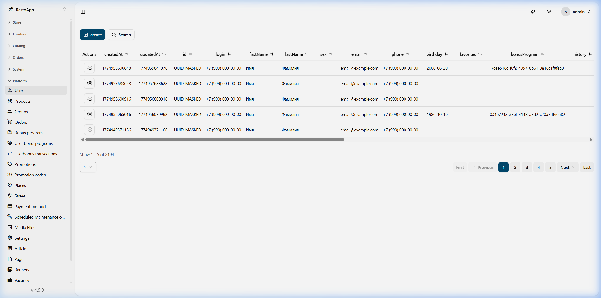
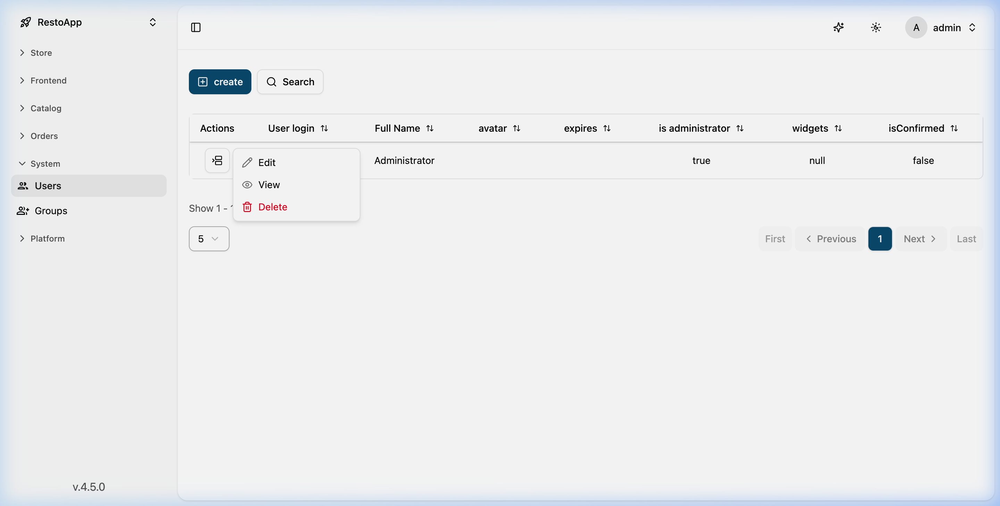
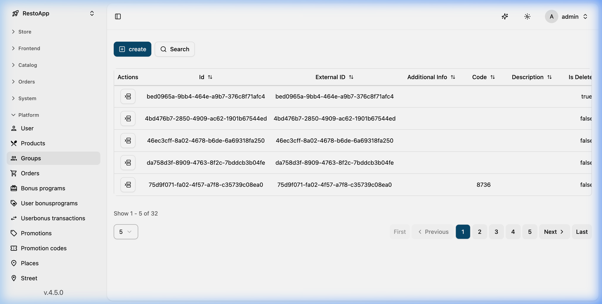
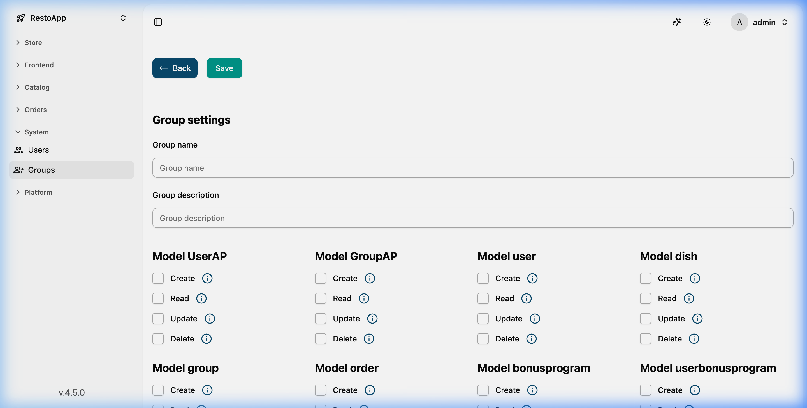

# 👥 Users and Groups Management (Access Permissions)

This section covers administrative accounts and configuring access permissions via groups. All these settings are located in the **Platform** tab.

## 👤 User Management
To manage accounts, navigate to **Platform -> User**. Here, you'll see a list of all users who have access to the management panel.

*Figure 1: General view of the user list in the Platform section.*

**User Actions:**
Using the action menu for each account, you can:
*   **View** user profile.
*   **Edit** data (name, email, password).
*   **Delete** accounts.

*Figure 2: Drop-down action menu for a specific user.*

## 🛡️ Groups and Access Rights
Instead of configuring permissions for each user individually, the system uses **Groups**. You create a group with a specific set of rights and then simply add the necessary users to it.

The section is located in **Platform -> Group**.

*Figure 3: List of existing groups in the system.*

### Configuring the Permission Matrix
For each group, you can configure a detailed permission matrix for every data model (dishes, orders, customers, etc.).

*Figure 4: Detailed configuration of rights (Create, Read, Update, Delete).*

**Access Levels:**
For each entity in the system (Dish, Order, Category, etc.), you can specify:
1.  **Create**: Ability to add new objects.
2.  **Read**: Access to view data.
3.  **Update**: Rights to edit existing data.
4.  **Delete**: Ability to remove objects from the database.

> [!IMPORTANT]
> Assigning a user to multiple groups sums their permissions. Use caution when granting Delete permissions.
